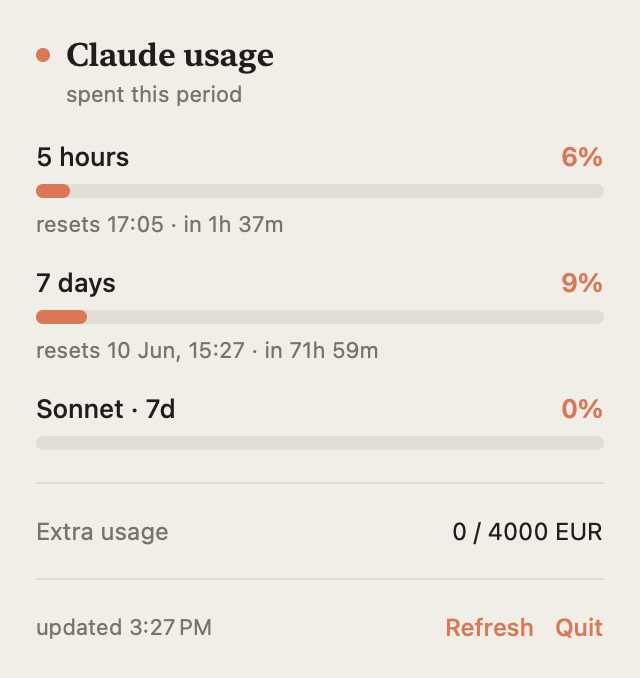

# Claude Limits

A tiny macOS menu-bar app that shows how much of your **Claude** usage you've
spent — at a glance, without opening the Claude app.

```
5h 6% · 7d 9%
```

Click it for a breakdown of the 5-hour and 7-day windows, per-model weekly
usage, extra-credit spend, and when each window resets.

<p align="center">
  
</p>

> Designed in Anthropic's warm "paper" palette: ivory background, ink text,
> clay/coral accent.

## Who it's for

Anyone on a **Claude Pro / Max** plan who uses **Claude Code** and wants a
permanent on-screen readout of their rolling usage limits.

## How it works

- Reads the Claude Code OAuth token from your **macOS Keychain**
  (the `Claude Code-credentials` item created by the `claude` CLI).
- Calls `GET https://api.anthropic.com/api/oauth/usage` — the same endpoint
  Claude Code's own `/usage` panel uses — and renders the result.
- Refreshes every 60 seconds, and on every menu open.

Nothing leaves your machine except that one request to Anthropic, made with
**your own** token. There are no servers, no analytics, no third parties.

## Requirements

- macOS 13 (Ventura) or newer
- Xcode command-line tools / Swift toolchain (to build)
- Claude Code installed and logged in (`claude` — so the token exists)

## Build & run

```bash
git clone https://github.com/kacharhin/claude-limits.git
cd claude-limits
./build.sh           # compiles + assembles ClaudeLimits.app
open ClaudeLimits.app
```

On first launch macOS will ask permission to read the `Claude Code-credentials`
keychain item — click **Always Allow**.

To keep it on screen, drag `ClaudeLimits.app` to `/Applications` and add it to
**System Settings → General → Login Items**.

## Customizing

- **Colours / palette** — `Sources/ClaudeLimits/Theme.swift`
- **Warning threshold** (default: highlight at ≥ 80% spent) — `Theme.barColor`
- **Refresh interval** (default 60s) — `UsageStore.startIfNeeded`
- **Menu-bar text & dropdown** — `UsageStore.menuTitle` / `App.swift`
- The UI labels are in Russian; change the strings in `App.swift` to taste.

## Caveats

`/api/oauth/usage` is **undocumented**. It's read-only and reflects your own
account, but Anthropic could change or remove it at any time, which would break
this app. No affiliation with Anthropic.

## License

MIT — see [LICENSE](LICENSE).
